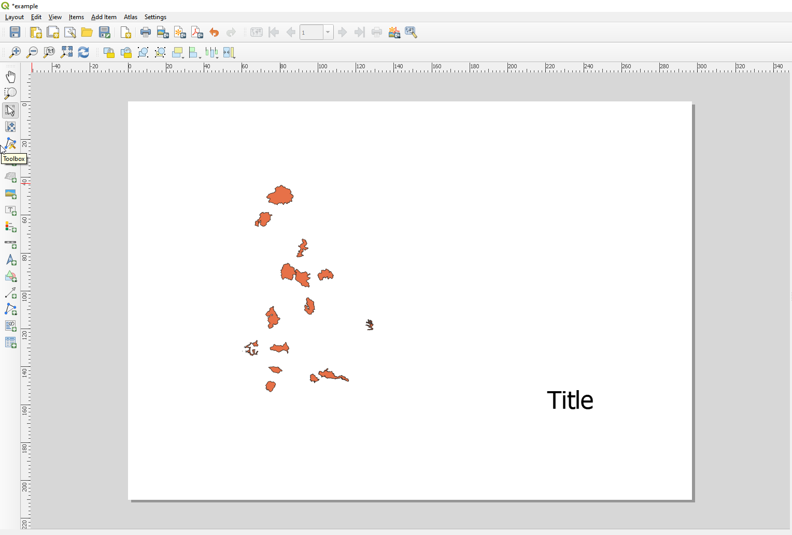
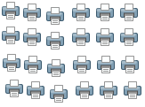

.. _create-output:

*******************
 Creating an Output
*******************

.. only:: html

   .. contents::
      :local:

The :ref:`figure below <figure_layout_output>` shows an example of print layout
including each type of layout items described in the previous section.

.. _figure_layout_output:

   Print Layout with map view, legend, image, scale bar, coordinates, text and
   HTML frame added

.. index:: Export as image, Export as PDF, Export as SVG

From the :menuselection:`Layout` menu or toolbar, you can output the print
layout to different file formats, and it is possible to modify the resolution
(print quality) and paper size:

* The |filePrint| :sup:`Print` icon allows you to print the layout to a
  connected printer or a PostScript file, depending on installed printer drivers

Export settings
===============

Whenever you export a print layout, there are a selection of export settings QGIS needs
to check in order to return the most appropriate output. These configurations
are:

* the :ref:`Export settings <layout_export_settings>` of the :guilabel:`Layout`
  panel, such as :guilabel:`Export resolution`, :guilabel:`Print as raster`,
  :guilabel:`Always export as vectors` or :guilabel:`Save world file`;
* the :guilabel:`Exclude page from exports` in the :ref:`page item properties
  <page_properties>` panel;
* the :guilabel:`Exclude item from exports` in the :ref:`item properties
  <layout_Rendering_Mode>` panel.

