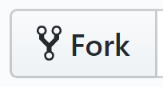

# Using Git Locally

We can clone our repo and use it locally on our machine, then sync (push) the changes to the web. *These instructions are for those using Windows.*

- Download Git from https://git-scm.com/downloads

- Install it
	- Set editor to `Nano` (this is the default option)

- Fork the repo (on GitHub.com)
	- Go to `https://github.com/nickbearman/Contributing-to-QGIS-Documentation`
	- Click the { height=35 } button to copy the repo to your profile and wait a few seconds while it completes
	- Click **Clone or download**
	- Use the copy clipboard icon { height=35 } to copy the path to the clipboard

- Clone repo (on your computer)
	- Go to wherever your folder is
	- Right click and choose **Git Bash Here**
	- Type in `git clone ` and paste in the URL (using Shift-Insert)
	- Press enter. *This will copy the repository from your GitHub web account to your local machine*

- Make a change to the file on your machine

- Add and commit
	- Use `git status` to find out where you are and what to do next
	- In Git Bash, type `git add <file>`
	- Type `git commit` and add your Git commit comment

- Push to your remote repo
	- `git push`
	- *It should give you a link on GitHub*. 
	
- Create Pull Request (on GitHub)
	- Select { height=30 }. 
	- Compare `nickbearman/Contributing-to-QGIS-Documentation` with `<your username>/Contributing-to-QGIS-Documentation`.
	- Click **Create Pull Request**. 
	- Fill in the details and click **Create pull request**. 
	

Then try adding an image in RST. See `example-1.rst` for an example. 

Working on GitHub website only.
Make updates, Create pull request. 
Push changes

on web, create pull request. 
merge pull request,
this brings everything up to date. 

Intro to Git (if you are new): http://swcarpentry.github.io/git-novice/

Great git cheat sheet: http://rogerdudler.github.io/git-guide/

Mike's resources: https://bitbucket.org/sruclees/help/wiki/Home

or clone main copy, then add remote:
git remote -v to check
git remote add <name> https://github.com/nickbearman/Contributing-to-QGIS-Documentation.git